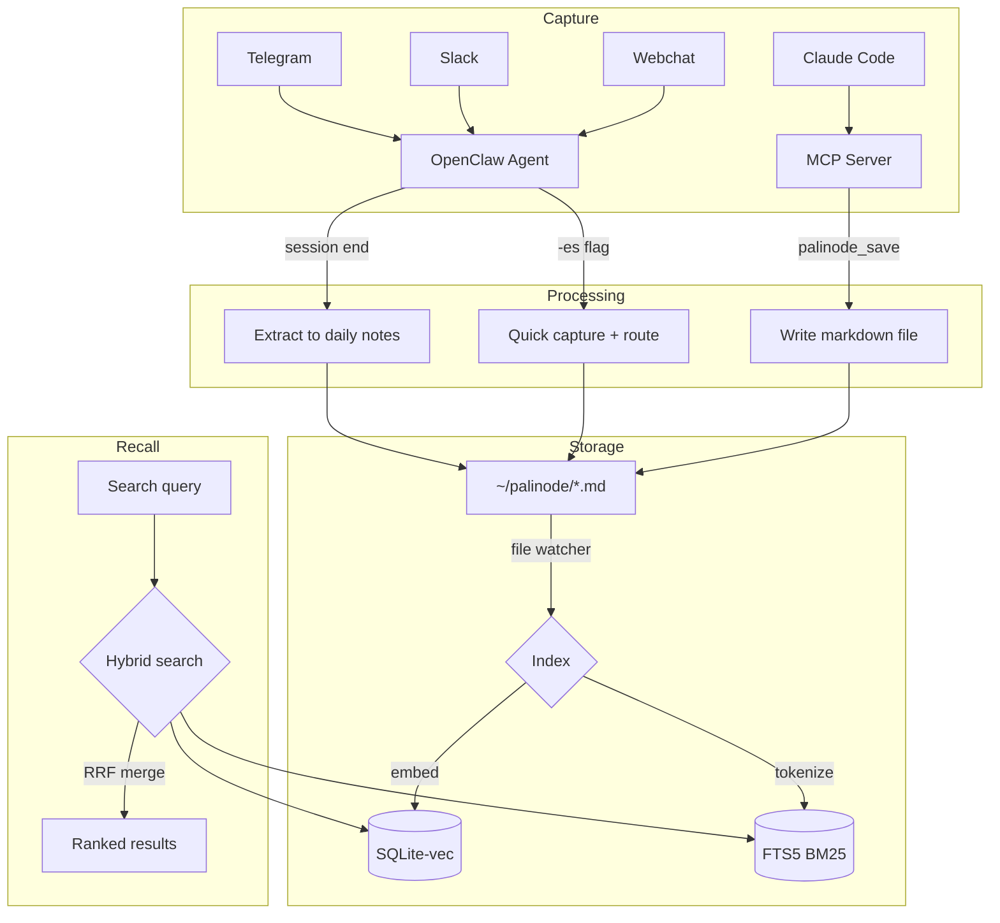

# Palinode 🧠

**Persistent long-term memory for AI agents — with provenance.**

*A palinode is a poem that retracts what was said before and says it better.
That's what memory compaction does.*

Git-native. Markdown-first. No database required.

---

## The Problem

AI agents wake up with amnesia every session. They don't remember who you are, what you're working on, or what was decided yesterday. You waste turns re-explaining context that should already be there. Current solutions either don't scale (flat files), produce uncurated noise (vector-only stores), or lock you into opaque databases you can't inspect.

## The Solution

Palinode gives your agent **14 MCP tools and a memory directory** — the agent decides what to remember, what to search, and when to consolidate. No rigid pipeline. No framework lock-in. Just tools, files, and git.

An MCP server works with Claude Code, Cursor, Codex, Antigravity, OpenClaw, or any MCP client. A session skill auto-captures milestones during coding. A deterministic executor handles compaction — the LLM proposes operations, the executor applies them. The LLM never touches your files directly.

Storage is typed markdown with YAML frontmatter. Search is hybrid BM25 + vector. History is git. Works with any LLM backend. If every service crashes, `cat` still works.

### Built for model step-changes

Most AI systems accumulate "compensating complexity" — workarounds for the last model's weaknesses that become constraints when a better model arrives. Palinode is designed to survive model upgrades:

- **Tools are the interface, not a pipeline.** Your agent calls `palinode_search` when it needs context, not because a pipeline forces 300 tokens of search results into every turn. Smarter models make better retrieval decisions on their own.
- **The executor is deterministic.** The LLM proposes KEEP/UPDATE/MERGE/SUPERSEDE/ARCHIVE. The executor validates and applies. Swap the LLM, keep the executor. ([ADR-001](docs/ADR-001-tools-over-pipeline.md))
- **Files and git don't depend on any model.** Markdown, YAML, `git blame` — none of this changes when Mythos or GPT-5 drops.
- **Auto-injection is optional scaffolding.** The OpenClaw plugin injects context automatically today (useful for current models). As models get smarter and use tools proactively, the injection pipeline becomes unnecessary — the tools remain.

### What it costs

| Turn | What happens | Tokens |
|---|---|---|
| Turn 1 | Core memory injected (people, projects, decisions) | ~4,200 |
| Every turn after | Relevant search snippets for your message | **~300** |
| Trivial messages ("ok", "yes", "👍") | Nothing — skipped automatically | **0** |

~300 tokens per turn. Less than a sentence of output. The alternative — re-explaining your project every session — costs the same tokens with none of the benefit.

---

## What Makes Palinode Different

Most agent memory systems are opaque databases you can't inspect, flat files that don't scale, or graph stores that require infrastructure. Palinode is **memory with provenance** — the only system where you can `git blame` every fact your agent knows.

### No other production system has these:

- **Git blame/diff/rollback as agent tools** — not just git-compatible files, but `palinode_diff`, `palinode_blame`, and `palinode_rollback` as first-class MCP tools your agent can call. [DiffMem](https://github.com/search?q=diffmem) and Git-Context-Controller are PoCs; Palinode ships 14 MCP tools including 5 git operations.

- **Operation-based compaction with a deterministic executor** — the LLM outputs structured ops (KEEP/UPDATE/MERGE/SUPERSEDE/ARCHIVE), a deterministic executor applies them. The LLM never touches your files directly. [All-Mem](https://arxiv.org/search/?query=all-mem+memory) does something similar on graph nodes; Palinode does it on plain markdown with git commits.

- **Per-fact addressability** — every list item gets an invisible `<!-- fact:slug -->` ID that survives git operations and is targetable by compaction. memsearch has per-chunk (heading-level); Hermes has per-entry (delimiter). Nobody has inline fact IDs.

- **4-phase injection pipeline** — Core → Topic → Associative → Triggered. Individual phases exist elsewhere (Letta core, LangMem search, Zep graph, ADK preload), but no system combines all four. [Perplexity deep research confirms](docs/perplexity-landscape-2026-03-31.md): "No widely documented system matches a four-phase pipeline with exactly the requested semantics."

- **If every service crashes, `cat` still works** — your memory is markdown files in a directory. Rebuild the index from files anytime.

---

## Features

> ✅ = production-ready &nbsp; 🧪 = implemented, beta &nbsp;

### Memory Storage ✅
- **Typed memories** — people, projects, decisions, insights, research (not flat text blobs)
- **Layered structure** — files split into Identity (`name.md`), Status (`-status.md`), and History (`-history.md`)
- **Fact IDs** — persistent, unique IDs (`<!-- fact:slug -->`) for precise auditing and compaction
- **YAML frontmatter** — structured metadata, categories, entity cross-references
- **Git-versioned** — every memory change has a commit, `git blame` your agent's brain
- **Graceful degradation** — vector index down → files still readable, grep still works

### Capture ✅
- **Session-end extraction** — auto-captures key facts from conversations to daily notes
- **`-es` quick capture** — append `-es` to any message to route it into the right memory bucket
- **Inbox pipeline** — drop PDFs, audio, URLs into a watch folder; they appear as research references

### Recall
- ✅ **Core memory injection** — files marked `core: true` are always in context
- ✅ **Tiered injection** — full content on turn 1, summaries on subsequent turns (saves tokens)
- ✅ **Hybrid search** — BM25 keyword matching + vector similarity merged with Reciprocal Rank Fusion
- ✅ **Content-hash dedup** — SHA-256 hashing skips re-embedding unchanged files (~90% savings)
- 🧪 **Temporal decay** — re-ranks results based on freshness and importance (beta — decay constants need tuning)
- 🧪 **Associative recall** — spreading activation across entity graph (beta)
- 🧪 **Prospective triggers** — auto-inject files when trigger contexts match (beta)

### Compaction 🧪
- **Operation-based** — LLM outputs JSON ops, deterministic executor applies them
- **Layered files** — Identity (slow-changing) / Status (fast-changing) / History (archived)
- **Weekly consolidation** — cron-driven, local LLM (OLMo/vLLM), git commits each pass
- **Security scanning** — blocks prompt injection and credential exfiltration in memory writes

### Integration ✅
- **OpenClaw plugin** — lifecycle hooks for inject, extract, and capture
- **MCP server** — 13 tools for Claude Code and any MCP client
- **FastAPI server** — HTTP API for programmatic access
- **CLI** — command-line search, stats, reindex

---

## Architecture



### Stack

| Layer | Technology | Why |
|---|---|---|
| Source of truth | Markdown + YAML frontmatter | Human-readable, git-versioned, portable |
| Semantic index | SQLite-vec (embedded) | No server, single file, zero config |
| Keyword index | SQLite FTS5 (embedded) | BM25 for exact terms, stdlib — no dependencies |
| Embeddings | BGE-M3 via Ollama (local) | Private, no API dependency, 1024d |
| API | FastAPI on port 6340 | Lightweight HTTP interface |
| MCP | Python MCP SDK (stdio) | Claude Code + any MCP client |
| Plugin | OpenClaw Plugin SDK | Lifecycle hooks for session inject/extract |
| Behavior spec | `PROGRAM.md` | Change how the memory manager thinks by editing one file |

---

## Requirements

- **Python 3.12+**
- **Ollama** with `bge-m3` model (for embeddings — `ollama pull bge-m3`)
- **Git** (for memory versioning)
- A directory for your memory files (local, or a private git repo)

Optional:
- **OpenClaw** (for agent plugin integration)
- **vLLM or Ollama with a chat model** (for weekly consolidation — any 7B+ model works)

### Tested With

| Component | Version |
|---|---|
| Embeddings | BGE-M3 via Ollama |
| Consolidation LLM | [OLMo 3.1 32B AWQ](https://huggingface.co/allenai/OLMo-3.1-32B-AWQ) via vLLM |
| Hardware | RTX 5090 32GB (consolidation), any CPU (embeddings + API) |
| Python | 3.12 |
| OS | Ubuntu 22.04 (Linux), macOS 14+ (development) |

Other models should work — the consolidation prompt is model-agnostic. Smaller models (8B) may produce less reliable JSON for compaction operations; use `json-repair` (included) as a safety net.

## Quick Start

### 1. Clone and install

```bash
git clone https://github.com/Paul-Kyle/palinode
cd palinode
python3 -m venv venv && source venv/bin/activate
pip install -e .
```

### 2. Create your memory directory

Your memories live in a separate directory from the code — choose one:

**Option A: Local only (simplest)**
```bash
mkdir -p ~/.palinode/{people,projects,decisions,insights,daily}
cd ~/.palinode && git init
export PALINODE_DIR=~/.palinode
```

**Option B: Private GitHub repo (backup + multi-machine sync)**
```bash
# Create a PRIVATE repo on GitHub (e.g., yourname/palinode-data)
git clone https://github.com/yourname/palinode-data.git ~/.palinode
mkdir -p ~/.palinode/{people,projects,decisions,insights,daily}
export PALINODE_DIR=~/.palinode
```

**Option C: Self-hosted git server**
```bash
git clone git@your-server:palinode-data.git ~/.palinode
export PALINODE_DIR=~/.palinode
```

> **Important:** Your memory directory is PRIVATE. It contains personal data about you, your projects, and the people you work with. Never make it public. The code repo (`Paul-Kyle/palinode`) contains zero memory files — your data stays yours.

### 3. Configure

```bash
cp palinode.config.yaml.example ~/.palinode/palinode.config.yaml
```

Edit `~/.palinode/palinode.config.yaml`:
```yaml
memory_dir: "~/.palinode"          # Where your memory files live
ollama_url: "http://localhost:11434"  # Your Ollama instance
embedding_model: "bge-m3"            # Pull with: ollama pull bge-m3
```

### 4. Run services

```bash
# Start the API server
PALINODE_DIR=~/.palinode python -m palinode.api.server

# In another terminal: start the file watcher (auto-indexes on save)
PALINODE_DIR=~/.palinode python -m palinode.indexer.watcher

# Check health
curl http://localhost:6340/status
```

### 4. Use from Claude Code (MCP)

Add to `~/.claude/claude_desktop_config.json`:

```json
{
  "mcpServers": {
    "palinode": {
      "command": "ssh",
      "args": ["-o", "StrictHostKeyChecking=no",
               "user@your-server",
               "cd /path/to/palinode && venv/bin/python -m palinode.mcp"]
    }
  }
}
```

See [docs/claude-code-setup.md](docs/claude-code-setup.md) for details.

### 5. Use from OpenClaw

Install the plugin to your OpenClaw extensions directory:

```bash
cp -r plugin/ ~/.openclaw/extensions/openclaw-palinode
```

The plugin provides `before_agent_start` (inject), `agent_end` (extract), and `-es` capture hooks.

**Already using OpenClaw's built-in memory?** See [docs/INSTALL-OPENCLAW-MIGRATION.md](docs/INSTALL-OPENCLAW-MIGRATION.md) for what to disable (MEMORY.md, Mem0, session-memory hook) and why Palinode replaces all of them with ~5,700 fewer tokens per session.

---

## Git-Powered Memory

Palinode is the only memory system where you can `git blame` your agent's brain.

### What changed this week?
```bash
palinode diff --days 7
# or via tool: palinode_diff(days=7)
```

### When was this fact recorded?
```bash
palinode blame projects/my-app.md --search "Stripe"
# → 2026-03-10 a1b2c3d — Chose Stripe over Square for payment integration
```

### Show a file's evolution
```bash
palinode timeline projects/mm-kmd.md
# Shows every change with dates and descriptions
```

### Revert a bad consolidation
```bash
palinode rollback projects/mm-kmd.md --commit a1b2c3d
# Creates a new commit, nothing lost
```

### Sync to another machine
```bash
palinode push  # backup to GitHub
# On Mac: git pull in your palinode-data clone
```

### Browse your memory
```bash
# List all people
ls ~/.palinode/people/

# Read a person's memory file
cat ~/.palinode/people/alice.md

# Find all files about a topic
palinode_search("alice project decisions")

# See entity cross-references
palinode_entities("person/alice")
```

Memory files are plain markdown — edit with any text editor, VS Code, Obsidian, or `vim`. Changes are auto-indexed by the file watcher within seconds.

---

## Migrating from Mem0

If you have existing memories in Mem0 (Qdrant), Palinode can import them:

```bash
python -m palinode.migration.run_mem0_backfill
```

This exports all memories, deduplicates (~40-60% reduction), classifies
them by type (LLM-powered), groups related memories, and generates
typed markdown files. Review the output before reindexing.

---

## Memory File Format

```yaml
---
id: project-mm-kmd
category: project
name: my-app
core: true
status: active
entities: [person/paul, person/peter]
last_updated: 2026-03-29T00:00:00Z
summary: "Multi-agent murder mystery engine on LangGraph + OLMo 3.1."
---
# My App — Mobile Checkout Redesign

Your content here. Markdown, as detailed or brief as you want.
Palinode indexes it, searches it, and injects it when relevant.
```

Mark `core: true` for files that should always be in context. Everything else is retrieved on demand via hybrid search.

---

## Configuration

All behavior is configurable via `palinode.config.yaml`:

```yaml
recall:
  core:
    max_chars_per_file: 3000
  search:
    top_k: 5
    threshold: 0.4

search:
  hybrid_enabled: true     # BM25 + vector combined
  hybrid_weight: 0.5       # 0.0=vector only, 1.0=BM25 only

capture:
  extraction:
    max_items_per_session: 5
    types: [Decision, ProjectSnapshot, Insight, PersonMemory]

embeddings:
  primary:
    provider: ollama
    model: bge-m3
    url: http://localhost:11434
```

### Remote Model Endpoints (Mac Studio)
If you are running the `start_mlx_servers.sh` script on the Mac Studio, the following MLX models are exposed on the network:

See [palinode.config.yaml.example](palinode.config.yaml.example) for the complete reference with all defaults.

---

## Tools

Available in OpenClaw conversations and Claude Code (via MCP):

| Tool | Description |
|---|---|
| `palinode_search` | Semantic + keyword search with optional category filter |
| `palinode_save` | Save a memory (content, type, optional metadata) |
| `palinode_ingest` | Fetch a URL and save as a research reference |
| `palinode_status` | Health check — file counts, index stats, service status |
| `palinode_history` | Retrieve git history for a specific memory file |
| `palinode_entities` | Search associative graph by entity or cross-reference |
| `palinode_consolidate` | Preview or run operation-based memory compaction |
| `palinode_diff` | Show memory changes in the last N days |
| `palinode_blame` | Trace a fact back to the session that recorded it |
| `palinode_timeline` | Show the evolution of a memory file over time |
| `palinode_rollback` | Safe commit-driven reversion of memory files |
| `palinode_push` | Sync memory to a remote git repository |
| `palinode_trigger` | Add or list prospective narrative triggers |

---

## API Reference

| Method | Path | Description |
|---|---|---|
| `GET` | `/status` | Health check + stats |
| `POST` | `/search` | `{query, category?, limit?, hybrid?}` → ranked results |
| `POST` | `/search-associative` | Associative recall via entity graph |
| `POST` | `/save` | `{content, type, slug?, entities?}` → creates memory file |
| `POST` | `/ingest-url` | `{url, name?}` → fetch + save to research |
| `GET/POST` | `/triggers` | List or add prospective triggers |
| `POST` | `/check-triggers` | Check if any triggers match a query |
| `GET` | `/history/{file_path}` | Git history for a file |
| `POST` | `/consolidate` | Run or preview compaction |
| `POST` | `/split-layers` | Split files into identity/status/history |
| `POST` | `/bootstrap-fact-ids` | Add fact IDs to existing files |
| `GET` | `/diff` | Git diff for a file |
| `GET` | `/blame` | Git blame for a file |
| `GET` | `/timeline` | Git activity over time |
| `POST` | `/rollback` | Revert a file |
| `POST` | `/push` | Push memory changes to git remote |
| `GET` | `/git-stats` | Git summary stats |
| `POST` | `/reindex` | Full rebuild of vector + BM25 indices |
| `POST` | `/rebuild-fts` | Rebuild BM25 index only |

---

## How Palinode Compares

### vs MEMORY.md (OpenClaw/Hermes built-in)

| | MEMORY.md | Palinode |
|---|---|---|
| **Storage** | One flat file, grows until truncated | Typed files (people, projects, decisions, insights) |
| **Injection** | Dump entire file into prompt (~5K tokens, truncated at 18K chars) | 4-phase: core summaries on turn 1 (~4K tokens), search snippets per turn (~300 tokens) |
| **Search** | None — `grep` or read the whole thing | Hybrid BM25 + vector, ranked by relevance |
| **Scaling** | Gets worse over time (bigger file = more truncation) | Gets *better* over time (nightly consolidation compacts, not appends) |
| **History** | None — edits overwrite | Git blame every line, rollback any change |
| **Multi-agent** | One file per agent, no sharing | Shared memory dir, entity cross-references |
| **When it breaks** | File missing = total amnesia | Services down = `cat` and `grep` still work |

MEMORY.md costs ~5,000 tokens per session to inject a file that gets staler every week. Palinode costs ~300 tokens per turn and stays fresh via nightly consolidation.

### vs Mem0

| | Mem0 | Palinode |
|---|---|---|
| **Storage** | Qdrant vectors + graph DB (opaque) | Markdown files (human-readable, editable) |
| **Search** | Vector similarity only | Hybrid BM25 + vector (RRF fusion) |
| **Inspection** | Need API/dashboard to see what's stored | `cat`, `grep`, VS Code, Obsidian — any text editor |
| **History** | Audit logs in DB | `git blame`, `git diff`, `git rollback` as agent tools |
| **Compaction** | Behavior summaries (lossy) | Operation-based KEEP/UPDATE/MERGE/SUPERSEDE/ARCHIVE (non-lossy) |
| **Offline** | Qdrant must be running | Files exist on disk regardless |
| **MCP tools** | 4-6 (save, search, list, delete) | 14 (+ git ops, triggers, session capture) |
| **Portability** | Tied to Qdrant instance | `cp -r` to any machine, or push to GitHub |

Mem0 is a black box. Palinode is a directory. If you can `ls`, you can understand your agent's memory.

---

## Design Philosophy

Palinode makes specific bets about how agent memory should work:

1. **Tools, not pipelines.** Give the model capabilities (search, save, diff, rollback). Let it decide when to use them. Don't force retrieval into every turn — let smarter models make smarter retrieval decisions.

2. **Files are truth.** Not databases, not vector stores, not APIs. Markdown files that humans can read, edit, and version with git. This survives any model change.

3. **Outcomes, not procedures.** Tell the consolidation LLM *what* to achieve ("keep what's true, archive what's stale"), not *how* to do it step by step. The less your system prescribes, the more it gains from a smarter model.

4. **Consolidation, not accumulation.** 100 sessions should produce 20 well-maintained files, not 100 unread dumps. Memory gets smaller and more useful over time.

5. **Graceful degradation.** Vector index down → read files directly. Embedding service down → grep. Machine off → it's a git repo, clone it anywhere.

6. **Zero compensating complexity.** Every workaround for a model's weakness is technical debt that breaks on the next model. Separate business rules (keep forever) from model scaffolding (delete on upgrade). ([ADR-001](docs/ADR-001-tools-over-pipeline.md))

---

## Roadmap

### Shipped (v0.5)
| What | Details |
|---|---|
| Core system | Typed markdown, SQLite-vec, FTS5, FastAPI, file watcher |
| 14 MCP tools | search, save, ingest, status, history, entities, consolidate, diff, blame, timeline, rollback, push, trigger, session_end |
| Hybrid search | BM25 + vector + Reciprocal Rank Fusion |
| Git provenance | blame, diff, rollback, push as agent-callable tools |
| Operation-based compaction | KEEP/UPDATE/MERGE/SUPERSEDE/ARCHIVE with deterministic executor |
| Session skill | Auto-captures milestones across Claude Code, Cursor, Codex, Antigravity |
| Nightly consolidation | Cron-driven via local LLM (OLMo, any 7B+) |
| OpenClaw plugin | 4-phase injection + session capture |

### Next (v1.0) — Tools-first architecture
| What | Why |
|---|---|
| Optional injection pipeline | Make auto-injection configurable. Default to tools-first for Mythos-class models |
| `palinode_list` + `palinode_read` | Browse and read memory files from any MCP client |
| Prompt storage (`prompts/` category) | Reusable prompt templates as searchable memories |
| Gemini multimodal embeddings | Index images, PDFs alongside text memories |
| Hermes Agent contribution | Submit palinode skill to NousResearch |
| Homebrew tap | `brew install palinode` |

### Future (v2.0) — Model-agnostic memory infrastructure
| What | Why |
|---|---|
| Tools-only mode | Remove pipeline entirely. Model decides all retrieval |
| Outcome-based compaction prompts | Replace procedural prompts with goal specs |
| Clean package architecture | `store/`, `recall/`, `compaction/` modules |
| Mintlify docs site | Searchable documentation |
| Community memory templates | Shared starter memories for common domains |

---

## Inspirations & Acknowledgments

Palinode is informed by research and ideas from several projects in the agent memory space. We believe in attributing what we learned and borrowed.

### Architecture Inspiration

- **[OpenClaw](https://github.com/openclaw/openclaw)** — The plugin SDK, lifecycle hooks, and `MEMORY.md` pattern that Palinode extends and replaces. Palinode started as a better memory system for OpenClaw agents.

- **[memsearch](https://zilliztech.github.io/memsearch/) (Zilliz)** — Hybrid BM25 + vector search over markdown files, content-hash deduplication, and the "derived index" philosophy (vector DB is a cache, files are truth). Palinode's Phase 1.5 hybrid search and dedup are directly inspired by memsearch's approach.

- **[Letta](https://github.com/letta-ai/letta) (formerly MemGPT)** — Tiered memory architecture (Core/Recall/Archival), agent self-editing via tools, and the MemFS concept (git-backed markdown as memory). Palinode's tiered injection and `core: true` system parallel Letta's Core Memory blocks.

- **[LangMem](https://github.com/langchain-ai/langmem) (LangChain)** — Typed memory schemas with update modes (patch vs insert), background consolidation manager, and the semantic/episodic/procedural split. Palinode's planned consolidation cron (Phase 2) follows LangMem's background manager pattern.

### Specific Ideas Borrowed

| Feature | Source | How We Adapted It |
|---|---|---|
| Hybrid search (BM25 + vector + RRF) | memsearch (Zilliz) | FTS5 + SQLite-vec with RRF merging, zero new dependencies |
| Content-hash deduplication | memsearch (Zilliz) | SHA-256 per chunk, skip Ollama calls for unchanged content |
| Tiered context injection | Letta (MemGPT) | `core: true` files always injected; summaries on non-first turns |
| Typed memory with frontmatter | LangMem + Obsidian patterns | YAML frontmatter categories, entities, status fields |
| Two-door principle | [OB1 / OpenBrain](https://github.com/NateBJones-Projects/OB1) (Nate B. Jones) | Human door (files, inbox, -es flag) + agent door (MCP, tools, API) |
| Temporal anchoring | [Zep / Graphiti](https://github.com/getzep/zep) | `last_updated` + git log for when memories changed |
| Background consolidation | LangMem | Weekly cron distills daily notes into curated memory |
| Entity cross-references | [Mem0](https://github.com/mem0ai/mem0), [Cognee](https://github.com/cognee-ai/cognee) | Frontmatter `entities:` linking files into a graph |
| Memory security scanning | [Hermes Agent](https://github.com/NousResearch/hermes-agent) (MIT) | Prompt injection + credential exfiltration blocking on save |
| FTS5 query sanitization | [Hermes Agent](https://github.com/NousResearch/hermes-agent) (MIT) | Handles hyphens, unmatched quotes, dangling booleans |
| Capacity display | Hermes Agent prompt builder pattern | `[Core Memory: N / 8,000 chars — N%]` for agent self-regulation |
| Observational memory (evaluating) | [Mastra](https://mastra.ai/research/observational-memory) | Background observer agent pattern for proactive memory updates |

### Research References

- *Memory in the Age of AI Agents: A Survey* — [TeleAI-UAGI/Awesome-Agent-Memory](https://github.com/TeleAI-UAGI/Awesome-Agent-Memory)
- Nate B. Jones — [OpenBrain Substack](https://natesnewsletter.substack.com/) on context engineering and the "two-door" principle

### What's Ours

Based on a [comprehensive landscape analysis](docs/perplexity-landscape-2026-03-31.md) (March 2026, covering Letta, LangMem, Mem0, Zep, memsearch, Hermes, OB1, Cognee, Hindsight, All-Mem, DiffMem, and others), these features are unique to Palinode:

1. **Git operations as first-class agent tools** — `palinode_diff`, `palinode_blame`, `palinode_rollback`, `palinode_push` exposed via MCP. No other production system makes git ops callable by the agent.
2. **KEEP/UPDATE/MERGE/SUPERSEDE/ARCHIVE operation DSL** — LLM proposes, deterministic executor disposes. Closest analogue is All-Mem (academic, graph-only). No production system does this on markdown.
3. **Per-fact addressability via `<!-- fact:slug -->`** — HTML comment IDs inline in markdown, invisible in rendering, preserved by git, targetable by compaction operations.
4. **4-phase injection pipeline** — Core (always) → Topic (per-turn search) → Associative (entity graph) → Triggered (prospective recall). Research confirms no system combines all four.
5. **Files survive everything** — if Ollama dies, if the API crashes, if the vector DB corrupts — `cat` and `grep` still work. The index is derived; the files are truth.

If you know of prior art we missed, please [open an issue](https://github.com/Paul-Kyle/palinode/issues).

---

## Contributing

Palinode is in active development. Issues and PRs welcome.

See the [GitHub Issues](https://github.com/Paul-Kyle/palinode/issues) for the current roadmap and open tasks.

---

## License

MIT

---

*Built by [Paul Kyle](https://phasespace.co) ([@Paul-Kyle](https://github.com/Paul-Kyle)) with Claude Opus, Sonnet, Gemini, Codex, and OLMo — AI agents who use Palinode to remember building Palinode.* 🧠
